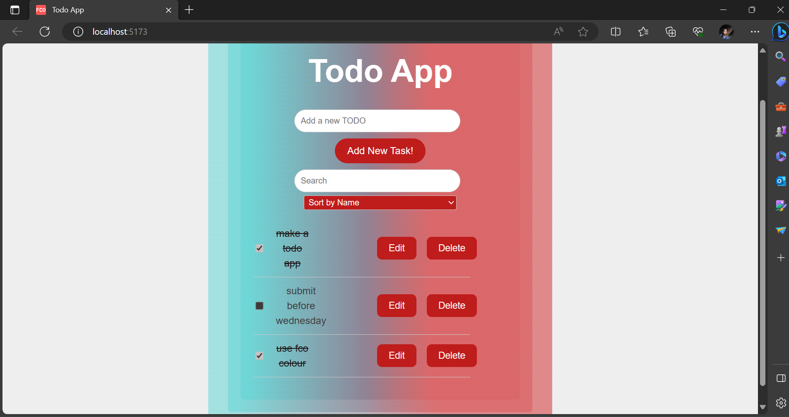

# Todo App



A simple TODO app built with React that allows users to create, manage, and organize their tasks.

## Features

- Create new TODO entries.
- Edit existing TODO entries.
- Delete TODO entries.
- Mark tasks as completed.
- Search through tasks.
- Sort tasks by name or last edited time.

## Getting Started

### Prerequisites

- Node.js and npm (Node Package Manager) installed on your computer.

### Installation

1. Clone the repository:

   ```bash
   git clone https://github.com/your-username/todo-app.git
   cd todo-app
   ```

npm install

npm start

npm run build
